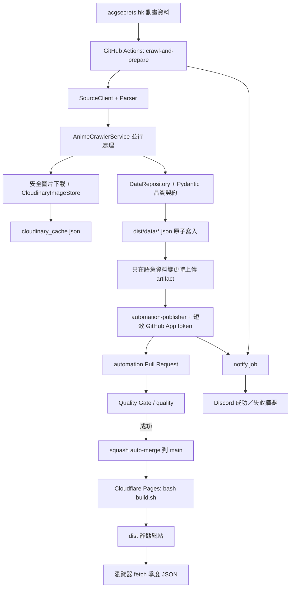
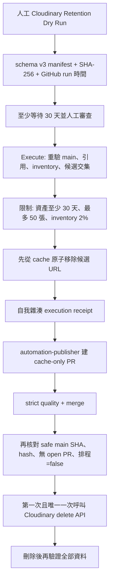
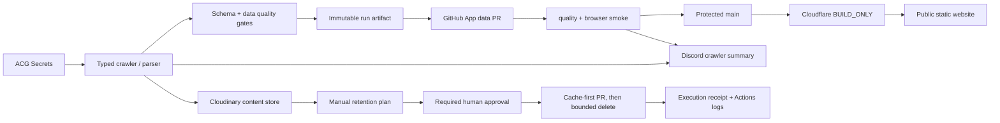

# 動畫資訊爬蟲：目前專案架構與平台設定現況報告

> 報告日期：2026-07-14（Asia/Taipei）
> 修改基準：`origin/main` commit `dfa8c0a`（`ci: lint workflows and shell scripts (#10)`）
> 報告性質：完成架構強化與自動發布改造後的「目前現況」，不是改造前稽核。
> 平台更新：已補回 retention Required reviewer、以安全測試確認 job 會等待核准，並關閉 admin bypass。

## 1. 執行摘要

### 1.1 一句話理解這個系統

這是一套「排程 ETL 資料管線 + Git 版控資料庫 + 靜態網站」：GitHub Actions 定時從 `acgsecrets.hk` 取得資料，Python 驗證並保存季度 JSON，Cloudinary 保存封面，資料透過受保護的 Pull Request 合併到 `main`，最後由 Cloudflare Pages 建置並發布；系統沒有常駐後端、API server 或傳統資料庫。

### 1.2 目前整體判定

核心架構已由單一爬蟲腳本提升為「有資料契約、可重現建置、fail-closed、可稽核」的正式發布管線。人工 crawler、automation PR、Quality Gate、Cloudflare 部署、Discord 通知，以及第一次正式排程都已成功。

目前最重要的工作不再是重寫架構。Actions 預設權限、Repository-level 重複 secrets、Discord 去敏、Dependabot、瀏覽器 smoke、retention CLI coverage、圖片像素限制、schema format 與 workflow 靜態分析都已完成；接下來以 Windows directory retry、災難復原量化與 CSP 收緊為主。

Required reviewer 已經過 `Waiting for approval` 實測，`can_admins_bypass=false` 也已由 GitHub API確認。這代表平台核准閘門完成，但在正式維護條件與 aged manifest 都完成前，仍不要核准或執行真正的 Cloudinary Retention Execute。目前排程開關為 `true`，工作流程本身也會 fail closed，因此沒有即時自動刪圖風險。

### 1.3 現況燈號

| 項目 | 狀態 | 判定 |
|---|---|---|
| 爬蟲與資料契約 | 綠 | 0 parse failure、0 fallback ID、拒絕空資料與異常跌幅 |
| 自動資料發布 | 綠 | GitHub App 建 PR，`quality` 通過後 squash auto-merge |
| 靜態建置與部署 | 綠 | 單一 `build.sh`、hash lock、Cloudflare 正式部署成功 |
| 每日排程 | 綠 | 已啟用；2026-07-14 第一次正式排程成功 |
| Discord 通知 | 綠 | 人工與正式排程成功通知都已收到 |
| `main` 保護 | 綠 | PR、strict `quality`、禁止刪除與 force push、無 bypass actor |
| Secret 最小權限 | 綠 | Environment 分層正確；不再使用的 Repository secrets 已依撤銷後刪除順序清理 |
| Retention 程式安全 | 綠 | 30+30 天、50 張、2%、cache-first、多重 revision/hash 綁定 |
| Retention 平台核准 | 綠 | Required reviewer、Waiting 測試與禁止 admin bypass 都已完成 |
| 監控與告警 | 綠 | Sentry 已停用；Discord 是唯一外部告警通道，錯誤訊息已去敏 |
| 前端測試 | 綠／黃 | Playwright smoke 已驗證頁面、資料、篩選、console 與圖片；無障礙自動測試仍可補強 |
| 來源改版預警 | 綠 | 每日 09:15 唯讀 selector canary；失敗才傳 Discord，不寫資料或圖片 |
| 本機開發環境 | 綠 | Python 3.11.9 正常；工作分支由最新 `main` 建立 |

## 2. 報告依據與限制

本報告交叉使用下列證據：

- 正式 Git：本機 `main` 已 fast-forward 到 `origin/main` commit `dfa8c0a`，本次 selector canary 分支由該 revision 建立。
- GitHub 即時 API：repository、Ruleset、Actions、Environments、variables、secret 名稱及最新 workflow 狀態。
- GitHub Actions log：最近正式 `main` Quality Gate 與 2026-07-14 第一次 schedule。
- Cloudflare：2026-07-13 設定截圖、Cloudflare check，以及 2026-07-14 無 Cookie 的正式站 HTTP 驗證。
- Cloudinary：程式安全契約、先前 dry-run 數字與 Git 追蹤 cache；未使用 Cloudinary 管理 API重新盤點即時 inventory。

為避免外洩：

- 報告只列 secret 名稱，不讀取或顯示 secret 值。
- GitHub 無法讀回 secret 原文，因此無法證明三個 Environment 裡的 Cloudinary secret 是否為完全相同的 key。
- Cloudflare 沒有使用 API token 做即時後台查詢；實際設定以使用者提供畫面、成功部署與實站回應為準。
- GitHub App 的完整安裝權限無法用目前使用者 token 重新列出，但 PR #3 的作者、短效 token、受保護合併與實際成功結果可證明發布路徑有效。

## 3. 系統架構

### 3.1 正常資料發布流程



### 3.2 沒有資料變更時

這條路徑已由 2026-07-14 第一次正式排程實證：

1. crawler 重新取得 6 季、共 349 筆資料。
2. 6 季均為 0 parse failure。
3. `DataRepository` 比對 `anime_list` 後判定沒有語意差異。
4. `publish-data-pr` 被正確略過，不建立空 PR、不產生 Git 歷史噪音。
5. Discord 仍發送成功摘要。
6. `main` 與 Cloudflare 不需要重新部署。

### 3.3 失敗時

- 來源網站、圖片下載、Cloudinary、資料契約、建置或 CI 任一關卡失敗，都會回傳非零狀態。
- 未通過全部 gate 前不會建立可合併的正式資料版本。
- `main` 保留上一版已驗證資料，Cloudflare 繼續提供上一個成功部署。
- `notify` 使用 `always()` 彙整 crawler 與 publisher 結果；Discord 傳送失敗也會讓 workflow 紅燈。
- 若資料 PR 已通過 gate 並合併，之後 Discord 才失敗，GitHub 不會回滾已合併資料；此時紅燈代表告警通道失敗，不代表資料未發布。

### 3.4 Retention 流程



Retention 不會刪除季度 JSON。candidate 為 0、manifest 太新、資料異常、cache PR 未合併、`main` 改變、排程不是 `false`、存在 open PR、hash 不一致或 Cloudinary 未逐項確認成功時，都會停止。

## 4. 目錄與元件責任

| 檔案／目錄 | 責任 | 重要位置 |
|---|---|---|
| `generate_static.py` | 爬蟲／build-only 主入口、季度協調、Jinja 建置、static 安全替換 | 77–84、87–193、196–304 |
| `models.py` | Anime、DataQuality、QuarterDataset Pydantic schema | 14–138 |
| `services/settings.py` | 環境變數解析、範圍驗證、路徑與 Cloudinary credential 要求 | 35–138 |
| `services/http_client.py` | 來源 HTTP、retry/timeout、圖片 SSRF 與下載邊界 | 29–97、107–224 |
| `services/parser.py` | 純 BeautifulSoup/lxml HTML 解析與 selector 契約 | 13–105 |
| `services/selector_canary.py` | 唯讀來源 selector／parser 契約檢查 | 全檔 |
| `services/anime_service.py` | parser、圖片、cache 的並行協調與錯誤彙整 | 74–164 |
| `services/image_store.py` | Cloudinary quota、圖片驗證、hash 去重與上傳 | 21–128 |
| `services/cache_repository.py` | thread-safe flat JSON cache、managed public ID 驗證、原子保存 | 14–98 |
| `services/data_repository.py` | JSON schema、品質 gate、semantic no-op、原子寫入 | 30–219 |
| `services/atomic_io.py` | 同目錄 temp、flush、fsync、`os.replace` | 12–37 |
| `services/notifier.py` | workflow outcome 判定與 Discord payload | 43–160 |
| `services/retention.py` | 引用集合、Cloudinary inventory、候選與安全刪除 | 100–443 |
| `manage.py` | `validate-data`、`verify-dist`、`validate-all`、通知命令 | 24–157 |
| `cloudinary_cleaner.py` | retention manifest、receipt、受保護 prepare/execute CLI | 1–735 |
| `backfill_ids.py` | 一次性歷史真實 ID 回填；預設 dry-run | 54–192 |
| `templates/` | Jinja2 HTML 唯一來源 | `base.html`、`index.html` |
| `static/` | CSS 與 main.js 唯一來源 | `static/css`、`static/js` |
| `dist/data/` | Git 追蹤的正式季度資料 | 36 個 JSON |
| `build.sh` | Cloudflare 唯一正式建置入口 | 全檔 |
| `_headers` | Cloudflare CSP、安全標頭與快取規則 | 全檔 |
| `.github/workflows/` | Quality Gate、crawler、selector canary、retention plan/execute | 5 個 workflow |
| `tests/` | parser、schema、error、retention、browser smoke、workflow safety 等測試 | 13 個測試模組 |
| `docs/` | 部署、平台設定、安全維運與災難復原 | 既有兩份手冊 + 本報告 |

## 5. 使用技術與鎖定版本

### 5.1 Python 與資料管線

| 技術 | 鎖定版本 | 用途 |
|---|---:|---|
| Python | 3.11（CI 為 3.11.15） | crawler、驗證與靜態建置 |
| Pydantic | 2.13.4 | 資料 schema 與品質摘要 |
| requests | 2.34.2 | 來源、圖片、Discord HTTP |
| urllib3 | 2.7.0 | retry policy |
| BeautifulSoup | 4.15.0 | DOM 解析 |
| lxml | 6.1.1 | BeautifulSoup parser backend |
| Pillow | 12.3.0 | 下載圖片真實格式驗證 |
| Cloudinary SDK | 1.45.0 | 封面上傳、quota 與 retention API |
| Jinja2 | 3.1.6 | 靜態 HTML 產生 |
| python-dotenv | 1.2.2 | 本機 `.env` |
| tzdata | 2026.2 | Asia/Taipei 時區資料 |

### 5.2 品質與供應鏈工具

| 技術 | 鎖定版本 | 用途 |
|---|---:|---|
| pytest | 9.1.1 | 測試 |
| pytest-cov | 7.1.0 | branch coverage |
| Ruff | 0.15.21 | lint 與 format |
| pip-tools | 7.5.3 | 產生 hash lock |
| pip-audit | 2.10.1 | 已知 Python 漏洞掃描 |

`requirements-build.txt`、`requirements-canary.txt`、`requirements.txt`、`requirements-dev.txt` 都是完整版本與 hash 鎖定。canary lock 只在 build 依賴上增加 BeautifulSoup／lxml，不含 Cloudinary／Pillow；直接依賴寫在相對應的 `*.in`，正式安裝一律使用 `--require-hashes` 的 `*.txt`。

### 5.3 前端

前端不是 React／Vue／Node SPA；它是 Jinja 產生的靜態 HTML，搭配 Alpine.js 與原生 JavaScript：

| 技術 | 版本 | 用途 |
|---|---:|---|
| Alpine.js | 3.13.3 | 篩選、狀態與互動 |
| Bootstrap | 5.1.3 | 版面與元件樣式 |
| Font Awesome | 5.15.4 | 圖示 |
| SweetAlert2 | 11.26.25 | 使用者提示 |
| html2canvas | 1.4.1 | 分享清單產圖 |
所有外部 CDN URL 都鎖完整版本並提供 SRI；沒有 `package.json`、npm build 或前端 bundler。

### 5.4 明確不存在的元件

- 沒有常駐 Python web server。
- 沒有 REST／GraphQL API。
- 沒有 PostgreSQL、MySQL、SQLite、D1 或 R2。
- 沒有使用者登入、伺服器端 session 或會員資料。
- 沒有背景 worker 或 message queue。

以目前 2,067 筆唯讀資料與每日批次更新量，這是合理且低維運成本的選擇。只有需要即時更新、多人收藏同步、登入或大量複雜查詢時，才值得增加資料庫與 API。

## 6. 資料契約與儲存

### 6.1 季度 JSON envelope

每個 `dist/data/<year>_<season>.json` 使用：

```json
{
  "schema_version": 1,
  "anime_list": [],
  "generated_at": "2026-07-13T16:38:36.39697+08:00",
  "source_url": "https://...",
  "quality": {
    "source_count": 75,
    "record_count": 75,
    "parse_failure_count": 0,
    "fallback_id_count": 0,
    "missing_story_count": 0,
    "missing_date_count": 0,
    "missing_time_count": 0
  }
}
```

`missing_*` 範例數字僅示意；實際值由 records 重算。

### 6.2 寫入前強制條件

`models.py` 與 `services/data_repository.py` 會強制：

- envelope 與 Anime 都是 `extra="forbid"`；舊式 `{"error": ...}` 或未知 key 無法混入正常資料。
- `anime_list` 不可為空。
- `record_count + parse_failure_count == source_count`。
- embedded quality 必須可由 records 完整重算。
- 預設 parse failure ratio 必須為 0。
- fallback ID ratio 必須為 0，且禁止 `未知ID`。
- 同季度 `bangumi_id` 不可重複，名稱不分大小寫不可重複。
- 新筆數不得低於前一版的 70%。
- `generated_at` 必須包含時區，並正規化為 Asia/Taipei。
- 圖片 URL 必須是預期 Cloudinary HTTPS 前綴。

驗證全部通過後才呼叫 `atomic_write_json`。如果 `anime_list` 與前版完全相同，`changed=false`，不更新 `generated_at`、source 或 quality，避免每天產生無意義 commit。

### 6.3 原子寫入

`services/atomic_io.py` 在目標檔同一個目錄建立暫存檔，寫入 UTF-8／LF／2-space JSON，執行 flush 與 fsync，再用 `os.replace` 交換。中途失敗時舊檔仍存在，不會留下半份 JSON。

單一季度是原子 transaction；多季度整次 crawl 不是單一本機 transaction。不過 GitHub Actions 只有完整 crawl、驗證、build 全部成功才上傳 artifact／建 PR，因此正式 `main` 不會發布半次更新。

### 6.4 Cloudinary cache

`cloudinary_cache.json` 是 string-to-string flat mapping，不會發布到 `dist`。目前正式 `main`：

- 2,279 個 entries。
- 332 個 `source_<sha256(url)>` alias。
- 1,947 個相容舊版的 content mapping。
- 尚無由目前資料觸發的新 `cloudinary_sha256_*` content entry；新上傳程式已支援 SHA-256 public ID。

Cache 有 RLock、原子保存、managed public ID 驗證；只有內容變更才寫檔。

## 7. 圖片與外部連線安全

### 7.1 來源網站

- 來源 URL 由固定 year／season 規則產生，不接受任意 URL。
- requests 設 timeout、retry 與 HTTP typed error。
- 只有尚未發布的未來季度 404 可以安全略過；其他來源錯誤上拋。
- parser 使用固定 selector 與 fixture；來源 DOM 改版時會 fail closed。

### 7.2 圖片下載

`services/http_client.py` 的圖片邊界包含：

- 只允許 HTTPS 與預設 443 port。
- URL 不可含帳密。
- host 必須在 `IMAGE_ALLOWED_HOSTS` allowlist；目前預設 `static.acgsecrets.hk`。
- DNS 必須解析，且所有 IP 都不得是 loopback、private、link-local、multicast、reserved 等非公網位址。
- 最多 3 次 redirect，每次 redirect 都重新做相同驗證。
- Content-Type 只接受圖片類型。
- 以串流方式限制最大 10 MiB。
- Pillow 再驗證內容確實是圖片。

這能降低 SSRF、偽裝內容與超大回應風險。尚未限制圖片像素寬高／總 pixels，仍可再補一道解壓縮炸彈防護。

### 7.3 Cloudinary

- quota 查詢失敗或 response 缺欄位時 fail closed。
- 預設 credits 使用達 90% 時停止，不以刪歷史季度救額度。
- source URL 與圖片內容分別做 SHA-256 去重。
- 新 public ID 使用 `anime_covers/<sha256>`；既有 32 位 MD5 ID仍可讀取，但不擴大到其他資料夾或任意 nested path。
- 上傳回應必須含預期 public ID 與 Cloudinary HTTPS URL。

## 8. 單一建置來源與前端執行

### 8.1 `build.sh`

Cloudflare 唯一正式入口：

1. `set -euo pipefail`。
2. `python -m pip install --require-hashes -r requirements-build.txt`。
3. 強制 `BUILD_ONLY=true` 與 `PYTHONDONTWRITEBYTECODE=1`。
4. 執行 `generate_static.py`，只驗證既有資料並建站，不連線 crawler／Cloudinary。
5. 執行 `manage.py validate-all`。

Cloudflare 因此不需要 Cloudinary、Discord、GitHub write 或爬蟲密碼。

### 8.2 唯一來源

- `templates/` 是 HTML source。
- `static/` 是 CSS／JavaScript source。
- `_headers` 是安全標頭 source。
- `dist/index.html`、`dist/static/`、`dist/_headers` 都是建置產物，不追蹤 Git。
- `dist/data/*.json` 是唯一被 Git 追蹤的 dist 內容。

`manage.py verify-dist` 比對 `static/` 與 `dist/static/` 的完整 SHA-256 tree，並核對 `index.html`、`_headers` 與 LF，防止 source／dist 分叉。

### 8.3 瀏覽器模式

- 頁面先從 Jinja hidden config 取得可用年／季與 build version。
- Alpine.js 恢復 localStorage 中的年份、季節、星期與 scroll 位置。
- 每次只 fetch 一季 `data/<year>_<season>.json?v=<buildVersion>`，最多 retry 3 次。
- 搜尋、星期篩選、分享清單都在瀏覽器完成。
- 分享圖片只接受 Cloudinary URL，使用 DOM API建立內容再交給 html2canvas。
- 沒有把使用者資料送回自建伺服器；localStorage 只保存 UI 偏好與分享清單。

### 8.4 CSP 與第三方前端

`_headers` 已有 CSP、X-Content-Type-Options、X-Frame-Options、Referrer-Policy、Permissions-Policy、COOP 與快取規則。正式站無 Cookie 請求已看到這些 header。

目前 CSP 仍允許：

- `script-src 'unsafe-eval'`：標準 Alpine build 所需。
- `style-src 'unsafe-inline'`：既有 inline style／前端元件所需。

外部 CDN 已有版本鎖與 SRI，風險已降低；長期若改用 `@alpinejs/csp`、移除 inline style 或 self-host 前端依賴，才可進一步收緊。

## 9. GitHub 平台設定現況

以下 GitHub 設定於 2026-07-14 以實際 Repository／Actions／Environment API 與已完成的工作紀錄交叉核對。

### 9.1 Repository 與 main 保護

- Repository：`0961282056/anime-static-crawler`，目前為 Public。
- Default branch：`main`。
- Ruleset：`main-protection`，狀態 Active，目標為 default branch。
- Bypass list：空白；GitHub Actions 與 GitHub App 都不需要繞過保護。
- 已禁止刪除 `main`。
- 已阻擋 force push／non-fast-forward 更新。
- 所有更新必須先建立 Pull Request。
- 必要審核數目前是 0，適合只有一位維護者的專案，但不是雙人審批模式。
- 必要狀態檢查為 `quality`，且要求分支在合併前保持最新。
- 允許 merge、squash、rebase 三種合併方式；自動化流程固定使用 squash。
- Repository 已開啟 auto-merge；PR 合併後尚未自動刪除分支。

這個設計的重點是：crawler 不直接推 `main`，而是使用 GitHub App 的短效 token 建立自動化分支與 PR；`quality` 通過後才自動 squash merge。這保留了 main 保護與完整稽核軌跡。

### 9.2 Actions 權限與供應鏈

Repository 的 Actions 平台預設目前是：

- Default workflow token permission：`read`。
- Workflow 不可自行核准 Pull Request review。
- Allowed actions：全部允許。
- 平台未強制 action SHA pinning。

各 workflow 仍明確宣告最小 `permissions`，第三方 action 全部鎖定完整 commit SHA；CI 另以 actionlint、ShellCheck 與 SHA pin 檢查防止 workflow／Bash 回歸。

### 9.3 四個 Environment

| Environment | main 限制 | Variables | Secrets | 用途 |
|---|---:|---|---|---|
| `crawler-production` | 是 | `CLOUDINARY_CLOUD_NAME`、`CRAWLER_USER_AGENT` | `CLOUDINARY_API_KEY`、`CLOUDINARY_API_SECRET`、`DISCORD_WEBHOOK_URL` | 正式爬蟲與最終 Discord 摘要 |
| `automation-publisher` | 是 | `AUTOMATION_APP_CLIENT_ID` | `AUTOMATION_APP_PRIVATE_KEY` | 建立短效 GitHub App token、分支與 PR |
| `cloudinary-retention-plan` | 是 | `CLOUDINARY_CLOUD_NAME` | Cloudinary key／secret | 只讀盤點與 manifest |
| `cloudinary-retention-execute` | 是 | `CLOUDINARY_CLOUD_NAME` | Cloudinary key／secret | cache-first PR 與最終刪除 |

這個分離方式正確：Cloudflare Pages 沒有正式服務憑證；publisher 沒有 Cloudinary／Discord 憑證；retention 與日常 crawler 也分成不同核准邊界。

### 9.4 Retention Environment 實測結果

2026-07-14 已把使用者 `0961282056` 設為 `cloudinary-retention-execute` 的 **Required reviewer**，保留只允許 `main` 的 branch policy，並保持 `Prevent self-review=false`，以符合單人維運現況。

安全驗證 run `29295967382` 使用 `plan_run_id=1` 與無效 confirmation `WAITING_TEST_ONLY`：

1. `prepare-cache-invalidation` 顯示 `waiting`。
2. job 的 steps 為空，代表 Environment 在任何程式與 secret 載入前成功攔截。
3. 沒有核准；確認 Waiting 後立即取消。
4. 最終 workflow 與三個 jobs 全部為 `cancelled`，沒有呼叫 Cloudinary，也沒有建立 PR。
5. `CRAWLER_SCHEDULE_ENABLED` 全程保持精確的小寫 `true`。

Required reviewer 已經生效，使用者也已在 Environment 畫面取消勾選 **Allow administrators to bypass configured protection rules**；GitHub API複核結果為 `can_admins_bypass=false`。Retention 的平台核准閘門至此完成。

### 9.5 Secrets 掃描與依賴更新

已開啟：

- GitHub Secret scanning。
- Secret scanning push protection。

另有下列付費或進階能力未強制：

- Non-provider secret patterns。
- Secret validity checks。

Dependabot security updates 已開啟；lock 檔中的依賴出現已知漏洞時可自動提出 PR，CI 的 `pip-audit` 仍繼續作為第二道防線。

### 9.6 Repository-level secrets 清理

Repository-level Actions secrets 已清空。Cloudflare 舊 token、Cloudinary 舊 Root key 及重複 secret 已依「先撤銷外部憑證、再刪 GitHub secret」順序處理；正式 crawler、retention、publisher 的必要秘密只保留在各自 Environment。2026-07-14 透過 GitHub API 再次確認 Repository secret 清單為空。

## 10. GitHub Actions 工作流程

### 10.1 Quality Gate

`.github/workflows/ci.yml` 在 PR、main push 與人工觸發執行，負責：

- 安裝完全鎖定且有 hash 的依賴。
- `pip check` 與 lock freshness。
- Ruff lint 與 format check。
- pytest branch coverage，最低 70%。
- 正式資料 schema／跨季度驗證。
- BUILD_ONLY 靜態建置與 deterministic source／dist 比對。
- JavaScript syntax check。
- Playwright browser smoke：頁面、JSON request、主要篩選、console 與圖片。
- Cloudflare 隔離建置。
- `pip-audit`。
- `actionlint` 與 ShellCheck。
- 第三方 GitHub Action 完整 SHA 檢查。

2026-07-14 本機完整驗證：183 tests 全部通過、branch coverage 78.90%、36 季／2,067 筆／9 年資料通過，3 個 static assets 完全一致；live selector canary 另成功解析 2026 夏季 75 張卡片。PR 合併前仍以 GitHub `quality` required check 作為正式 gate。

### 10.2 Scheduled Anime Crawler

`.github/workflows/crawler.yml`：

- cron：`0 17 * * *`，即台灣時間理論上的每日 01:00。
- GitHub scheduled workflow 不保證準點，可能因平台負載延遲。
- 排程只有在 Repository variable `CRAWLER_SCHEDULE_ENABLED` 精確等於小寫 `true` 時才工作。
- 人工 `workflow_dispatch` 不受這個開關阻擋，方便維修驗證。
- 透過 concurrency 避免同時跑兩套正式爬蟲。
- crawl、驗證、artifact、GitHub App PR、自動合併、Discord final summary 分成不同 job。
- 沒有語意變更時不建立 commit／PR，避免 Git 歷史噪音。

首次正式排程已成功：2026-07-14 02:46:12（Asia/Taipei）開始，約 02:47:48 完成。它處理 6 季共 349 筆、0 parse failure、0 fallback，因資料沒有語意變更而正確跳過 PR；Discord 通知也成功。這代表「排程開關、Environment、Cloudinary、建置、通知」主鏈已實際驗證。

### 10.3 Daily Source Selector Canary

`.github/workflows/selector-canary.yml` 每天台灣時間 09:15 執行，也允許人工啟動。主 job 只有 `contents: read`，只 GET 當季來源 HTML 並驗證 selector、所有卡片 parser 契約及 `bangumi_id` 唯一性；不載入 Cloudinary credential、不下載圖片、不寫 JSON／cache，也不建立 PR。成功只寫 GitHub summary；失敗才由獨立 `crawler-production` job 傳送不含 exception／HTML 的 Discord 告警。

### 10.4 Cloudinary Retention Dry Run

`.github/workflows/retention-plan.yml` 只允許人工執行：

- 產生可下載 manifest artifact。
- 不呼叫刪除 API。
- manifest 綁定 inventory、reference set、revision、hash 與產生時間。
- 正式 execute 只接受 GitHub workflow artifact，不接受本機自行產生的 manifest。

### 10.5 Cloudinary Retention Execute

`.github/workflows/retention-execute.yml` 是獨立、人工、分階段的維護流程：

1. 要求 crawler 排程開關為 `false`。
2. 驗證來源是人工 workflow、main revision 與 aged manifest。
3. manifest 最少等待 30 天；候選資產本身也必須至少 30 天未被引用。
4. 每批最多 50 張且不超過 inventory 的 2%。
5. 先建立 cache-only PR，等 `quality` 通過並 merge。
6. 重新抓 fresh main，確認 cache 安全狀態與 manifest 未漂移。
7. 最後才呼叫 Cloudinary delete API，並保存 execution receipt。

此流程的程式設計相當保守，Required reviewer 已通過 Waiting 實測，admin bypass 也已關閉。真正維護前仍必須逐項滿足排程關閉、aged manifest、無 open PR、備份與確認字串等條件。

目前 retention 沒有獨立 Discord 摘要；成功／失敗主要由 Actions、manifest artifact 與 execution receipt 稽核。若未來補通知，通知本身不可成為刪除成功的必要條件，也不得持有 Cloudinary delete 權限。

## 11. Cloudflare Pages 與 Access

### 11.1 Pages 建置設定

已確認正式設定：

| 項目 | 值 |
|---|---|
| Git repository | `0961282056/anime-static-crawler` |
| Production branch | `main` |
| Build command | `bash build.sh` |
| Build output directory | `dist` |
| Root directory | 空白（repository root） |
| Build system | Version 3 |
| Production auto deploy | 啟用 |

Production variables：

- `SKIP_DEPENDENCY_INSTALL=1`

Preview variables：

- `SKIP_DEPENDENCY_INSTALL=1`

Cloudinary、Discord、GitHub App private key 都不應放在 Pages；目前畫面已符合這個原則。`SKIP_DEPENDENCY_INSTALL=1` 只是不讓 Cloudflare 自動猜依賴，正式依賴仍由 `build.sh` 使用 hash lock 安裝。

### 11.2 正式站狀態

`https://anime-static-crawler.pages.dev/` 在無登入、無 Cookie 請求下回傳 HTTP 200，security headers 與 CSP 正常。先前合併後的瀏覽器驗證也看到：

- 網站標題與首頁正常。
- 2026 夏季 75 張卡片／圖片正常。
- 0 張破圖。
- Console 無 error／warning。
- 更新時間顯示 2026-07-13 16:38。

### 11.3 Cloudflare Access 的實際意義

先前 Access 畫面有 `anime-static-crawler.pages.dev` 的應用與 Bypass／Email Login 原則，但正式 pages.dev 現在對匿名使用者直接回 200。這代表有效結果是 **公開網站**。

- 若網站本來就要公開：目前行為正確，不需要用 Access 擋正式站。
- 若目標是私有：目前 Access 沒有真正攔住 production，需要重新檢查 application hostname、policy 順序與 Pages preview access。
- Preview URL 是否都需要登入，應另外用未登入／無痕視窗逐一驗證；不能只看 Dashboard 畫面判定。

## 12. Cloudinary 與 Discord

### 12.1 Cloudinary

新 key 已放進 crawler 與兩個 retention Environment；正式 Pages 沒有 key。日常 crawler 的圖片去重、quota fail-closed 與 cache contract 已通過人工及排程執行。

先前本機 dry-run 曾得到 `inventory=1980`、`referenced=1888`、`candidates=86`。這只是當時的盤點快照，不代表今天仍有 86 張可刪，也不能拿來直接 execute。正式維護必須重新跑 GitHub Dry Run、審查 artifact、等待規定時間後再執行。

### 12.2 Discord

`DISCORD_WEBHOOK_URL` 已放入 `crawler-production`，人工 crawler 與首次排程都收到 final summary，功能已證實正常。通知是整個 workflow lifecycle 的摘要，不只是 Python 程式跑完；成功、無資料變更、PR merge 與失敗都能用一致訊息呈現。

`services/notifier.py` 已把 HTTP／network exception 收斂成安全訊息：最多只保留 HTTP 狀態碼，不包含 webhook URL，也使用 `from None` 避免原始 request exception 出現在 traceback。回歸測試會放入假 secret URL，確認例外與 traceback 都不會洩漏。

### 12.3 Sentry 已停用

Python SDK、Browser CDN、前端初始化檔、workflow 變數、依賴鎖與 CSP ingest 白名單都已移除。Discord final notification job 是唯一外部告警通道；Sentry 舊 project/client key 應在 Sentry 平台撤銷或刪除，Cloudflare 的舊變數也應一併清除。

## 13. 測試、品質 Gate 與仍缺的測試

目前測試層次包含：

- parser fixture 與 selector。
- HTTP retry、typed exception、SSRF／redirect／大小／內容驗證。
- Pydantic schema、error key、異常筆數、跨季度 ID 一致性。
- atomic JSON／cache 與 rollback。
- error propagation、fallback 與 quota gate。
- deterministic static build、headers、LF 與 source／dist 一致性。
- retention manifest、hash、age、cap、cache-first 與 fail-closed 邏輯。
- retention prepare／execute CLI orchestration 與獨立 coverage。
- settings、notifier、GitHub App publisher helpers。
- Playwright browser smoke、每日 selector canary、actionlint 與 ShellCheck。

目前正式門檻已足以阻擋大部分資料破壞；仍可補強瀏覽器無障礙檢查、CSP 收緊後的前端回歸，以及 Windows static directory swap retry。

## 14. 現行資料與營運狀態

以 `origin/main` 2026-07-14 的正式資料統計：

| 指標 | 現況 |
|---|---:|
| 季度 JSON | 36 |
| Anime records | 2,067 |
| 年份 | 2018–2026，共 9 年 |
| `未知ID` | 0 |
| top-level `error` 檔案 | 0 |
| cache entries | 2,279 |
| source aliases | 332 |
| legacy content mappings | 1,947 |

最新 `2026_夏.json`：75 筆、`source_count=75`、0 parse failure、0 fallback、schema version 1；`generated_at=2026-07-13T16:38:36.39697+08:00`，已使用 Asia/Taipei offset。

資料品質儀表目前另顯示跨所有季度缺漏：story 939、date 5、time 5。這些欄位在來源本來就可能缺少，所以目前屬於觀測指標，不是硬失敗；若未來要升級為 gate，應先依年份／來源建立合理 baseline，不能直接要求歷史資料全部補齊。

## 15. 風險與優先順序

### P0：刪除流程放行前必做

- [x] 在 `cloudinary-retention-execute` 補回 Required reviewer。
- [x] 以無效 confirmation 實測 workflow 停在 Waiting for approval，未核准並立即取消。
- [x] 測試期間維持 `CRAWLER_SCHEDULE_ENABLED=true`。
- [x] 在 GitHub Environment 介面關閉 **Allow administrators to bypass configured protection rules**，API複核為 `can_admins_bypass=false`。

### P1：近期安全收尾

1. [完成] Actions default workflow permission 已改成 Read。
2. [完成] 按「先撤銷外部憑證、再刪 GitHub secret」順序移除 Repository-level 重複秘密。
3. [完成] 停用 Sentry，移除程式、建置、CSP 與 GitHub secret。
4. [完成] 修正 Discord exception 去敏並補洩漏測試。
5. [完成] 開啟 Dependabot security updates。

### P2：品質與可維護性

1. [完成] 增加 Playwright smoke test：首頁可載入、資料 request 成功、主要篩選可操作、console 乾淨、圖片無破損。
2. [完成] 讓 `cloudinary_cleaner.py` 的核心 orchestration 納入 coverage／獨立門檻。
3. [完成] 將系統錯誤與單筆 parse 錯誤分型；即使日後放寬 parse failure ratio，系統錯誤仍永遠阻擋寫入。
4. [完成] 強化 schema format：`bangumi_id` pattern、星期列舉、`HH:MM`、來源 URL 與 Cloudinary cloud/path。
5. [完成] 新增每日唯讀來源 selector canary、圖片 pixels limit。
6. [完成] CI 加入 actionlint／ShellCheck。
7. Windows static directory swap 加有限次 retry／backoff，降低開啟檔案造成的 WinError 5。

### P3：長期最佳化

1. 改用 CSP-compatible Alpine 或 self-host dependencies，逐步移除 `unsafe-eval`／`unsafe-inline`。
2. Repository 可改成只允許 squash 並開啟合併後自動刪分支，讓歷史更整潔。
3. Flat JSON cache 目前 2,279 entries 很合適；只有成長到數十萬筆、競爭寫入或查詢變複雜時，才考慮 SQLite／object storage index，不必現在為了架構感而導入資料庫。
4. 在災難復原手冊補明確 RTO／RPO、責任人、異地 Git／JSON 備份週期與最近一次 Cloudinary restore 演練日期。

## 16. 建議的目標架構

目前重構後的架構已接近適合此專案規模的目標，不建議再改成長駐 API server、容器叢集或資料庫。最合理的目標是保留「Git 為資料版本來源、Cloudflare 為純靜態發布、GitHub Actions 為批次控制面」，再補齊平台政策與觀測。



這個目標架構的原則：

- **資料面**：Pydantic contract、原子寫入、artifact 傳遞、語意 no-op。
- **控制面**：protected main、短效 GitHub App token、Environment 最小秘密、concurrency。
- **發布面**：Cloudflare 只建置已核准資料，不具 crawler／Cloudinary 權限。
- **刪除面**：與日常更新完全分離，人工審核、兩段 aging、cache-first、bounded delete。
- **觀測面**：Discord 做日常成功／失敗摘要；資料品質與 browser smoke 提早發現退化。

## 17. 給新手維運者的日常操作方式

### 平常每天

1. 不需要在電腦開啟 PowerShell，也不需要讓 `.venv` 常駐。
2. 等 GitHub 排程執行；時間可能晚於 01:00，這是 GitHub 排程特性。
3. 看 Discord 摘要：成功且「no semantic changes」代表一切正常，只是今天沒有資料需要提交。
4. 有資料變更時，系統會自動建立 PR、跑 `quality`、squash merge，Cloudflare 再自動部署。

### Discord 或 Actions 出現紅色失敗

1. 先不要連續重跑，也不要手動改 `dist/data`。
2. 打開該次 Actions run，找第一個紅色 job，而不是只看最後的通知 job。
3. 若是來源 selector／資料品質錯誤，保留失敗紀錄並修程式／fixture；fail-closed 表示舊網站仍維持可用。
4. 若是 GitHub／Cloudflare 暫時性錯誤，確認沒有產生半成品後再人工重跑一次。

### 要做 Cloudinary 清理

1. 先確認 Required reviewer 已真正生效。
2. 關閉 crawler 排程並等所有 crawler run 完成。
3. 人工跑 Retention Dry Run，下載並審查 manifest。
4. 等待規定 aging；不要使用本機舊 manifest。
5. 人工跑 Execute，先審 cache-only PR，再核准最終 Environment deployment。
6. 核對 execution receipt、Actions log 與 Cloudinary 結果，再把排程改回 `true`。

### 下次在本機改程式前

目前工作位於由最新 `main` 建立的 `codex/selector-canary`。現有 `.venv` 使用 Python 3.11.9，可繼續使用；每次 PR 合併後仍要切回 `main` 並以 fast-forward 同步。

## 18. 稽核限制與總結

本報告使用：目前 workspace source、正式 lock files、Git history／remote main、GitHub Repository／Ruleset／Actions／Environment 實際設定、既有 Cloudflare 截圖、正式站匿名 HTTP 與瀏覽器驗證，以及成功 workflow 記錄。

限制：

- 無法從 GitHub 讀出 secret 的值，只能核對名稱、作用域與 workflow 是否成功。
- Cloudinary inventory 的 1,980／86 是先前 dry-run 快照，不是 2026-07-14 即時盤點。
- Cloudflare Dashboard 設定以使用者截圖與實際 HTTP 行為交叉判讀；正式匿名 200 是最終有效行為。
- 本次已用本機 `.venv` 的 Python 3.11.9 重新執行 183 項測試：全部通過，branch coverage 78.90%，高於 70% 門檻；BUILD_ONLY 驗證 36 個季度、2,067 筆、9 年資料與 3 個靜態資產完全一致；live selector canary 成功解析 2026 夏季 75 張卡片。

### 最終判斷

這個專案已從「單一腳本直接改資料、直接推 main、可能自動刪圖」升級為有清楚信任邊界的靜態資料供應鏈。資料寫入契約、安全 retention、單一建置來源、測試 gate、秘密分層、語意 no-op、Asia/Taipei timestamp 與 Discord 摘要都已落地，而且人工與首次正式排程皆成功。

目前不需要再次大改核心架構。下一步依序完成 Windows directory retry、災難復原 RTO／RPO、squash-only／自動刪分支與 CSP 收緊；這些工作比現在導入資料庫更直接地提升可靠性。
